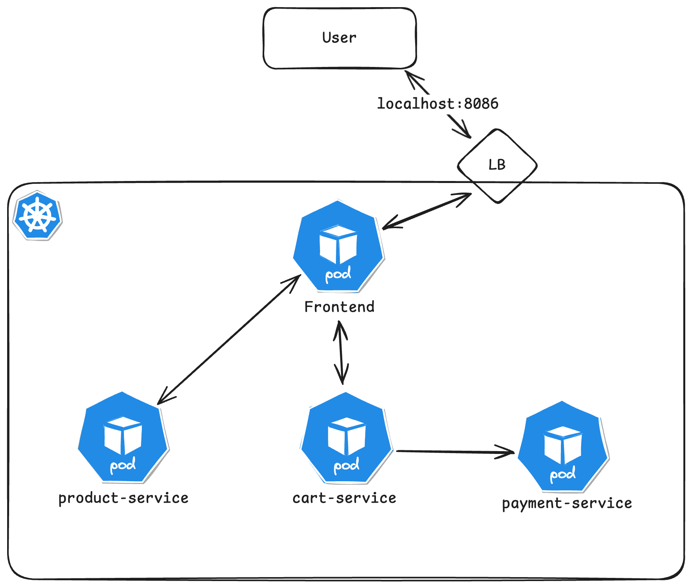

# AKTT1 Projekt

Dieses Repository beinhaltet alle benötigten Abgabedokumente für das Projekt der Lehrveranstaltung AKTT1.


## Roadmap

- ~~Aufgabe 1: Schreibt eine sehr einfache Applikation (Hello World oder ähnliches in irgendeiner Sprache), containerisiert diese und schreibt einmal ein Kubernetes Manifest dafür.~~

- Aufgabe 2: Versucht eine Applikation zu entwickeln, welche aus mehreren (mind. 3) Services besteht und schreibt ein Kubernetes Manifest dafür.

- Aufgabe 3: Schaut euch die Kubernetes Application Security Checklist an und implementiert 2-3 Aspekte in eurem Manifest.

- Aufgabe 4: Templating (10 % der Beurteilung, optional)

## Contributing

Default Development Branch ist `develop` daher bitte folgendes beachten:

```bash
git checkout develop
git pull
git checkout -b feature/AufgabeX-teilaufgabe
```

Bevor ein PR erstellt wird muss eine neue Release erstellt werden.
Die Versionsnummer sollte dem Semantic Versioning Modells folgen:

Given a version number **MAJOR.MINOR.PATCH**, increment the:

*MAJOR* version when you make incompatible API changes
*MINOR* version when you add functionality in a backward compatible manner
*PATCH* version when you make backward compatible bug fixes

Hierzu auf der Repository Startseite rechts auf "Releases" klicken, dann oben rechts auf "Draft a new Release", dann bei "Choose a tag" in der Suchleiste den neuen TAG eingeben und auf **+ Create a new tag** klicken. Als target den **feature/** Branch auswählen. Zuletzt auf **Publish Release**!

Abschließend einen PR auf `develop` erstellen und ein Review beantragen.

:information_source: : Beim erstellen eines PR auf `develop` läuft nun eine Pipeline die **automatisch den build und push auf DockerHub unter lzainzinger02/ macht.**

## Documentation

Hier wird die Vorgehensweise für das Projekt dokumentiert.
Die derzeitige Microservic-Architektur sieht wie folgt aus:



### Aufgabe 1
1. Erstellen eines einfachen index.html als Hello World website.
2. Dockerfile erstellen auf Basis des httpd images (Webserver).
3. Dockerimage builden und auf Dockerhub deployen:

```bash
docker build -t lzainzinger02/hello-world:1.0.1 .
docker push lzainzinger02/hello-world:1.0.1
```
Wenn man keinen Tag angibt direkt, dann muss ein Tag nachträglich mit 'docker tag hello-world ctadeshsb/hello-world:1.0.0' erstellt werden. Danach kann nach einem 'docker logi, ein 'docker push' erfolgen 

4. Manifestfiles erstellen in diesem fall `Deployment`und `Service`, zusätlich für das Setup ein `Namespace`Manifest.
5. Manifest anwenden:
```bash
kubectl apply -f setup.yaml
kubectl apply -f hello-world.yaml
```

🎉 es funktioniert.
```bash
lzainzinger@MacBook-Air-von-Lukas AKTT1_G8 % kubectl -n aktt1 get pods                                                                    
NAME                          READY   STATUS    RESTARTS   AGE
hello-world-b5f79bc75-wkvxl   1/1     Running   0          19m
```

### Aufgabe 2
1. Erstellen der Applikation in NestJS.
```bash
nest new project-name
```
2. Dockerfile und Image von Applikation erstellen (Wie Aufgabe 1.2 und 1.3).
3. Manifeste Erstellen und Anwenden wie in Aufgabe 1.4 und 1.5.
4. Testen der Microservices.
```bash
kubectl -n aktt1 port-forward pod/product-service-b65694644-rwnwl 3005:3000

lzainzinger@MacBook-Air-von-Lukas AKTT1_G8 % curl 127.0.0.1:3005/products
[{"id":1,"name":"Product A","price":100},{"id":2,"name":"Product B","price":200}]% 
```
5. Interaktion zwischen Microservices entwickeln.
6. Testen der gesamten Applikation.
7. Applikation Optimieren und 12 Factor App berücksichtigen.

## Authors
Gruppe 8
- Lukas Zainzinger - [@lzainzinger](https://www.github.com/lzainzinger)
- Christoph Tades - [@chrisfhb](https://www.github.com/chrisfhb)
- Martin Lampel - [@mlampel26](https://www.github.com/mlampel26)

